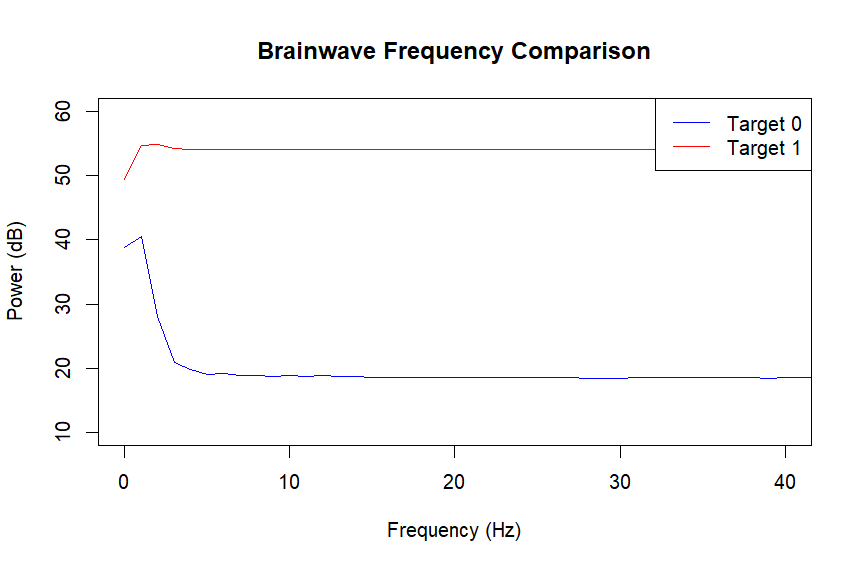

# EEG Signal Processing & Spectral Analysis in R

## Project Overview
This project demonstrates a reproducibility-focused pipeline for processing raw Electroencephalographic (EEG) data. The goal was to identify neural markers between two specific states by automating noise reduction and frequency decomposition.

## Methodology
* **Digital Signal Processing (DSP):** Applied a **3rd-order Butterworth High-pass filter** to mitigate low-frequency drift artifacts ($< 0.5$ Hz).
* **Feature Extraction:** Implemented **Welch’s Power Spectral Density (PSD)** estimation to quantify brain rhythms (Alpha, Beta).
* **Environment:** Developed in R using `tidyverse` for data manipulation and `gsignal` for signal processing.

## Results
The analysis highlights a distinct increase in metabolic effort/arousal during the **Active State** compared to the **Baseline**, as evidenced by the frequency-power distribution in the provided plots.

